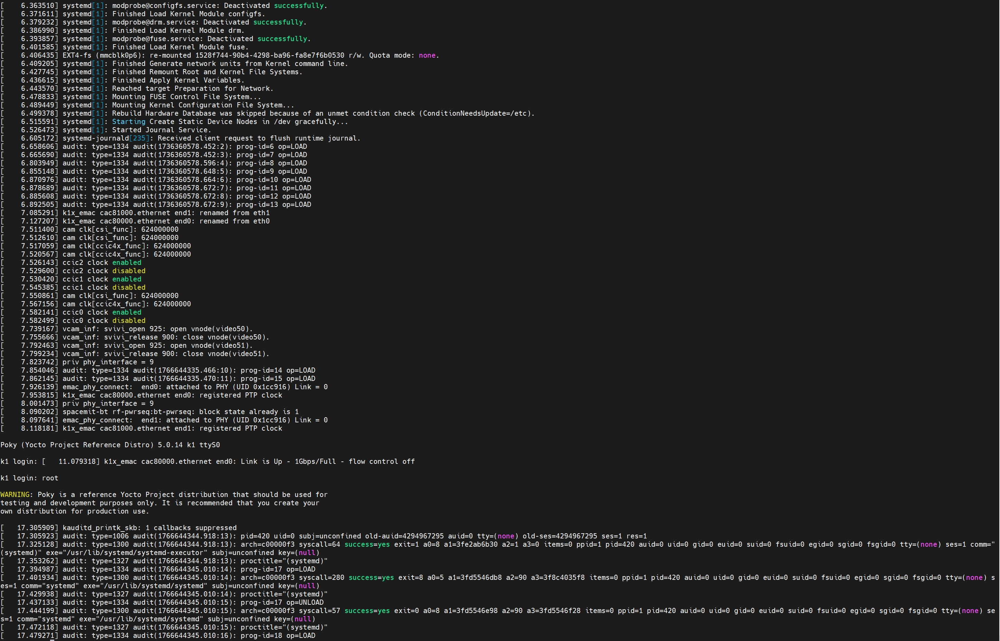
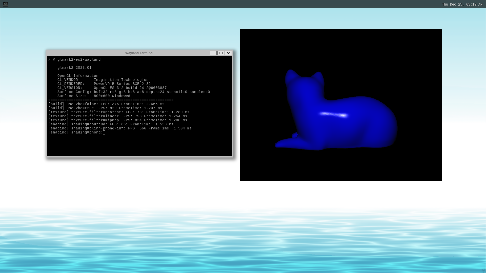

# SpacemiT K1 Yocto SDK

This project provides a set of Yocto layers and build scripts (initialized via `meta-k1/setup.sh`) for the SpacemiT K1 platform, used to generate images that can be flashed to an SD card.

## Feature Overview

### minimal Image

Minimal Linux, suitable for quick boot, serial debugging, and basic network testing.



### weston Image

Graphical environment with Weston (Wayland) compositor, supporting simple graphical applications on K1 (GPU acceleration available).



## Firmware Download and Flashing

- **Download (placeholder)**:
  - minimal image: <minimal-firmware-url>
  - weston image: <weston-firmware-url>

- **Flashing Example (write to SD card, confirm target device first)**:
  ```bash
  sudo dd if=core-image-minimal.wic of=/dev/sdX bs=4M conv=fsync status=progress
  sudo sync
  ```

- **Firmware root user password**: empty (press enter when prompted).

## Building Firmware from This Project

### Runtime Environment and Version Notes

- Recommended: Ubuntu 22.04/24.04, WSL2, or equivalent Linux environment.
- Required tools: `git`, `bash`, `python3`, and Yocto host dependencies (refer to Yocto official documentation).

### Steps

```bash
git clone <repo-url>
cd yocto-spacemit
git submodule update --init --recursive
source meta-k1/setup.sh
bitbake core-image-minimal # or bitbake core-image-weston
```

### Build Artifacts

- Located in `build/tmp/deploy/images/k1/` (includes `.wic`, bootfs, etc.).

## Feedback and Contributions

- Please submit issues with board model, reproduction steps, and logs.
- Welcome PRs using conventional commits and including test cases.
